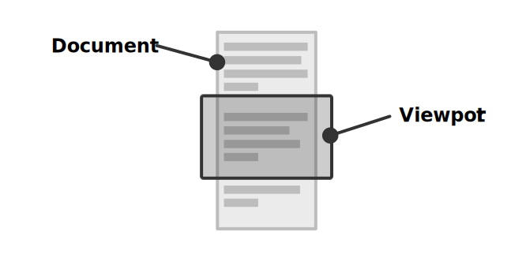

# Viewport

The Obsidian editor supports [huge documents](https://codemirror.net/examples/million/) with millions of lines. One of the reasons why this is possible, is because the editor only renders what's visible (and a little bit more).

Imagine that you want to edit a document that is too big to fit on your monitor. The Obsidian editor creates a "window" that moves across the document, only rendering the content within the window (and ignoring what's outside). This window is known as the editor's _viewport_.

Whenever the user scrolls through the document, or when the document itself changes, the viewport becomes out-of-date and needs to be recomputed.

If you want to build an editor extension that depends on the viewport, refer to [View plugins](view-plugins.md).
