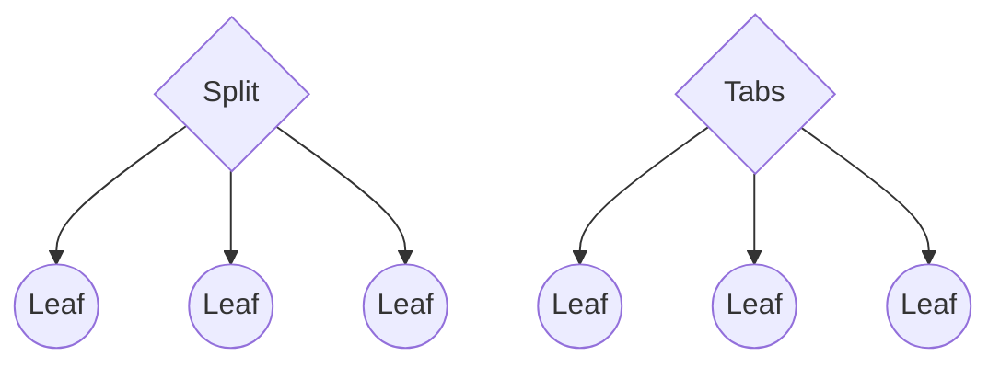
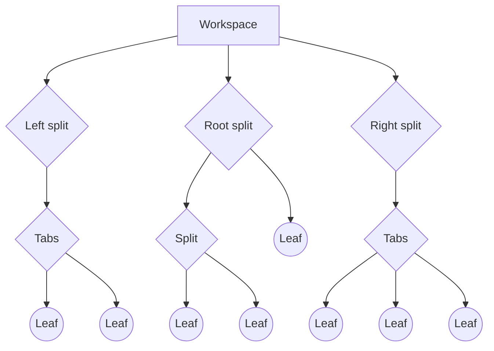
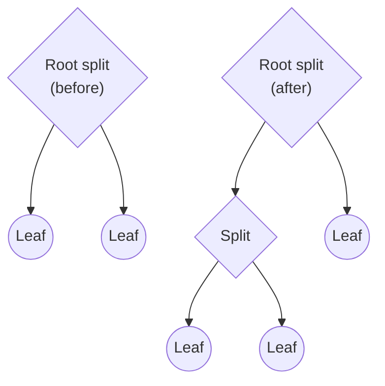
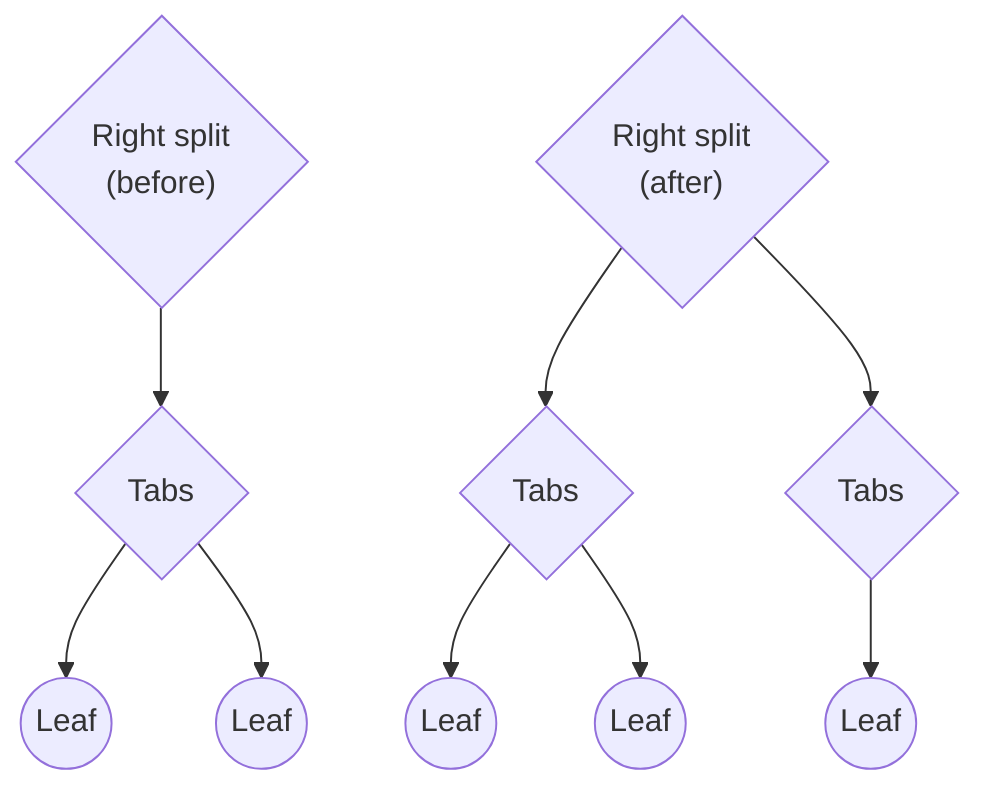

# Workspace

Obsidian lets you configure what content is visible to you at any given time. Hide the file explorer when you don't need it, display multiple documents side by side, or show an outline of your document while you're working on it. The configuration of visible content within your application window is known as the _workspace_.

The workspace is implemented as a [tree data structure](https://en.wikipedia.org/wiki/Tree_(data_structure)), where each node in the tree is referred to as a [workspace item](../api/classes/WorkspaceItem.md). There are two types of workspace items: [_parents_](../api/classes/WorkspaceParent.md) and [_leaves_](../api/classes/WorkspaceLeaf.md). The main difference is that parent items can contain _child_ items, including other parent items, whereas leaf items can't contain any workspace items at all.

There are two types of parent items, [_splits_](../api/classes/WorkspaceSplit.md) and [_tabs_](../api/classes/WorkspaceTabs.md), which determine how the children are presented to the user:



- A split item lays out its child items one after another along a vertical or horizontal direction.
- A tabs item only displays one child item at a time and hides the others.

The workspace has three special split items under it: _left_, _right_, and _root_. The following diagram shows a example of what a typical workspace could look like:



A leaf is a window that can display content in different ways. The type of leaf determines how content is displayed, and correspond to a specific _view_. For example, a leaf of type `graph` displays the [graph view](https://help.obsidian.md/Plugins/Graph+view).

## Splits

By default, the direction of the root split is set to vertical. When you create a new leaf to it, Obsidian creates a new column in the user interface. When you split a leaf, the resulting leaves are added to a new split item. While there's no defined limit to the number of levels you can create under the root split, in practice their usefulness diminish for each level.



The left and right splits work a little differently. When you split a leaf in the side docks, Obsidian generates a new tabs item and adds the new leaf under it. Effectively, this means they can only have three levels of workspace items at any time, and any direct children must be tabs items.



## Inspect the workspace

You can access the workspace through the [App](../api/classes/App.md) object. The following example prints the type of every leaf in the workspace:

```ts title="main.ts" {6-8}
import { Plugin } from "obsidian";

export default class ExamplePlugin extends Plugin {
  async onload() {
    this.addRibbonIcon("dice", "Print leaf types", () => {
      this.app.workspace.iterateAllLeaves((leaf) => {
        console.log(leaf.getViewState().type);
      });
    });
  }
}
```

## Leaf lifecycle

Plugins can add leaves of any type to the workspace, as well as define new leaf types through [custom views](../guides/custom-views.md). Here are a few ways to add a leaf to the workspace. For more ways, refer to [`Workspace`](../api/classes/Workspace.md).

- If you want to add a new leaf in the root split, use [`workspace.getLeaf(true)`](../api/classes/Workspace.md#getleaf).
- If you want to add a new leaf in any of the side bars, use [`workspace.getLeftLeaf()`](../api/classes/Workspace.md#getleftleaf) and [`workspace.getRightLeaf()`](../api/classes/Workspace.md#getrightleaf). Both let you decide whether to add the leaf to a new split.

You can also explicitly add the leaf in the split of your choice, using [`createLeafInParent()`](../api/classes/Workspace.md#createleafinparent).

Unless explicitly removed, any leaves that a plugin add to the workspace remain even after the plugin is disabled. Plugins are responsible for removing any leaves they add to the workspace.

To remove a leaf from the workspace, call [`detach()`](../api/classes/WorkspaceLeaf.md#detach) on the leaf you want to remove. You can also remove all leaves of a certain type, by using [`detachLeavesOfType()`](../api/classes/Workspace.md#detachleavesoftype).

## Leaf groups

You can create [linked panes](https://help.obsidian.md/User+interface/Workspace/Panes/Linked+pane) by assigning multiple leaves to the same group, using [`setGroup()`](../api/classes/WorkspaceLeaf.md#setgroup).

```ts
leaves.forEach((leaf) => leaf.setGroup("group1");
```
