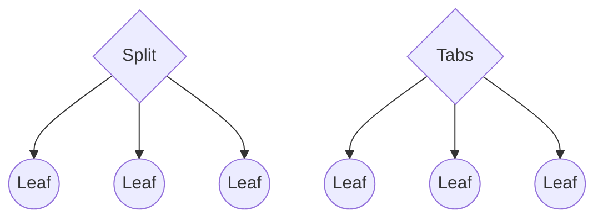
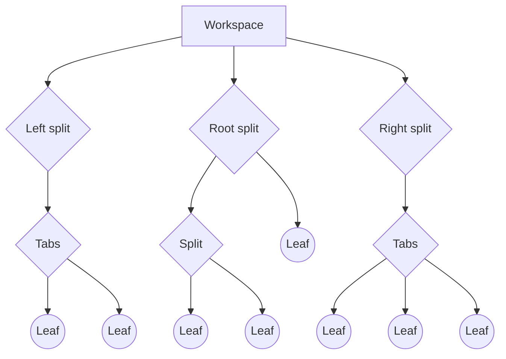
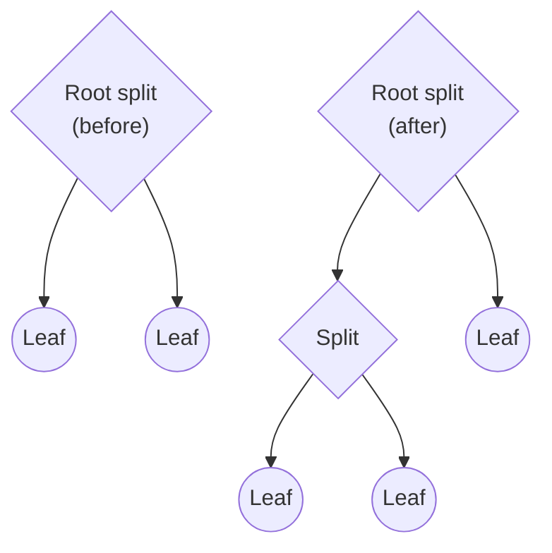
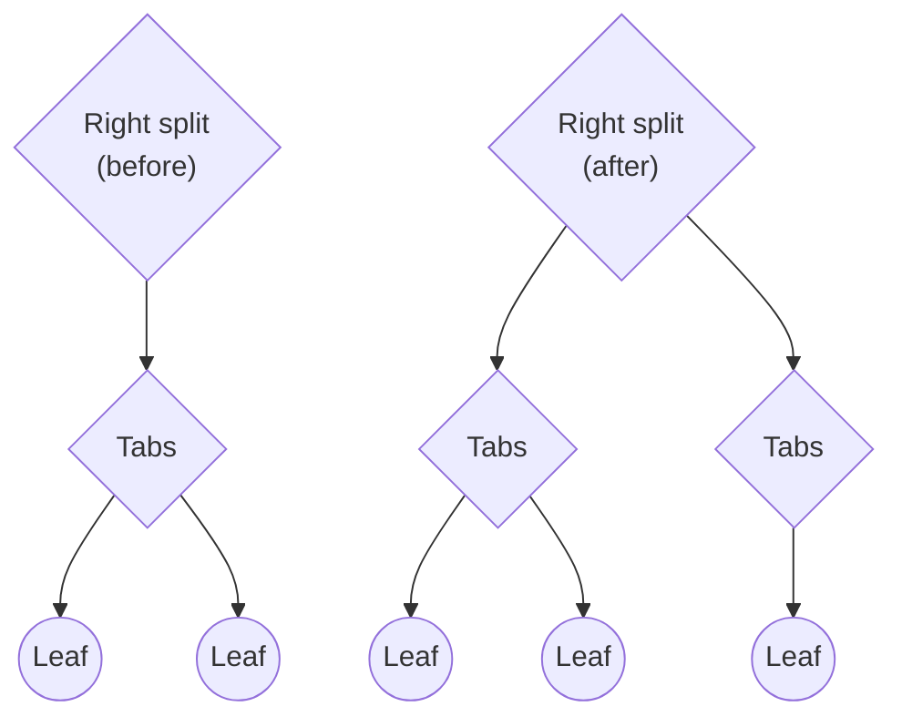

# Workspace

Obsidian lets you configure what content is visible to you at any given time. Hide the file explorer when you don't need it, display multiple documents side by side, or show an outline of your document while you're working on it. The configuration of visible content within your application window is known as the _workspace_.

The workspace is implemented as a [tree data structure](https://en.wikipedia.org/wiki/Tree_(data_structure)) that consists of _group nodes_ and _leaf nodes_. The main difference is that group nodes can contain any number of child nodes, including other group nodes, while leaf nodes can't contain any nodes at all.

There are two types of group nodes, _splits_ and _tabs_, which determine how the children are presented to the user:



- A split node lays out its child nodes one after another along a vertical or horizontal direction.
- A tabs node only displays one child node at a time and hides the others.

The workspace has three special split nodes under it: _left_, _right_, and _root_. The following diagram shows a example of what a more complex workspace could look like:



A leaf is a window that can display content in different ways. The type of leaf determines how content is displayed, and correspond to a specific _view_. For example, a leaf of type `graph` displays the [graph view](https://help.obsidian.md/Plugins/Graph+view).

## Splits

By default, the direction of the root split is set to vertical. When you create a new leaf to it, Obsidian creates a new column in the user interface. When you split a leaf, the resulting leaves are added to a new split node. While there's no defined limit to the number of levels you can create under the root split, in practice their usefulness diminish for each level.



The left and right splits work a little differently. When you split a leaf in the side docks, Obsidian generates a new tabs node and adds the new leaf under it. Effectively, this means they can only have three levels of nodes at any time, and any direct children must be tabs nodes.



## Access the workspace from your plugin

You can access the workspace through the [App](../api/classes/App.md) object. The following example prints the type of every leaf in the workspace:

```ts title="main.ts" {6-8}
import { Plugin } from "obsidian";

export default class ExamplePlugin extends Plugin {
  async onload() {
    this.addRibbonIcon("dice", "Print leaf types", () => {
      this.app.workspace.iterateAllLeaves((leaf) => {
        console.log(leaf.getViewState().type);
      });
    });
  }
}
```

## Create and detach leaves

There are several methods for creating leaves, which are fairly similar. To see all of them, refer to [`Workspace`](../api/classes/Workspace.md), but here are a few to get you started:

- If you want to create a new leaf in the root split, use [`workspace.getLeaf(true)`](../api/classes/Workspace.md#getleaf).
- If you want to create a new leaf in any of the side bars, use [`workspace.getLeftLeaf()`](../api/classes/Workspace.md#getleftleaf) and [`workspace.getRightLeaf()`](../api/classes/Workspace.md#getrightleaf). Both let you decide whether to create the leaf in a new split inside the side bar.

You can also explicitly create the leaf in the split of your choice, using [`createLeafInParent(leftSplit, index)`](../api/classes/Workspace.md#createleafinparent), where `index` is the position you want to insert the leaf on. For example, set `index` to 0 to prepend the leaf in the split.

To remove a leaf from the workspace, call [`detach()`](../api/classes/WorkspaceLeaf.md#detach) on the leaf you want to remove.

## Leaf groups

You can create [linked panes](https://help.obsidian.md/User+interface/Workspace/Panes/Linked+pane) by assigning multiple leaves to the same group, using [`setGroup()`](../api/classes/WorkspaceLeaf.md#setgroup).

```ts
leaves.forEach((leaf) => leaf.setGroup("group1");
```
