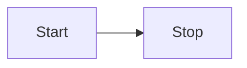

# Markdown post processing

If you want to change how a Markdown document is rendered in Preview mode, you can add your own _Markdown post processor_. As indicated by the name, the post processor runs _after_ the Markdown has been processed into HTML. It lets you add, remove, or replace [HTML elements](html-elements.md) to the rendered document.

The following example looks for any code block that contains a text between two colons, `:`, and replaces it with an appropriate emoji:

```ts title="main.ts" {6,15}
import { Plugin } from "obsidian";
import { Emoji } from "./emoji";

export default class ExamplePlugin extends Plugin {
  async onload() {
    this.registerMarkdownPostProcessor((element, context) => {
      const codeblocks = element.querySelectorAll("code");

      for (let index = 0; index < codeblocks.length; index++) {
        const codeblock = codeblocks.item(index);
        const text = codeblock.innerText.trim();
        const isEmoji = text[0] === ":" && text[text.length - 1] === ":";

        if (isEmoji) {
          context.addChild(new Emoji(codeblock, text));
        }
      }
    });
  }
}
```

The `Emoji` class extends [`MarkdownRenderChild`](../api/classes/MarkdownRenderChild.md), and replaces the code block with a `span` element with the emoji:

```ts title="emoji.ts" {3,19-22}
import { MarkdownRenderChild } from "obsidian";

export class Emoji extends MarkdownRenderChild {
  static ALL_EMOJIS: Record<string, string> = {
    ":+1:": "👍",
    ":sunglasses:": "😎",
    ":smile:": "😄",
  };

  text: string;

  constructor(containerEl: HTMLElement, text: string) {
    super(containerEl);

    this.text = text;
  }

  onload() {
    const emojiEl = this.containerEl.createSpan({
      text: Emoji.ALL_EMOJIS[this.text] ?? this.text,
    });
    this.containerEl.replaceWith(emojiEl);
  }
}
```

## Post-process Markdown code blocks

Did you know that you can create [Mermaid](https://mermaid-js.github.io/) diagrams in Obsidian by creating a `mermaid` code block with a text definition like this one?:

````md

````

If you change to Preview mode, the text in the code block becomes the following diagram:


If you want to add your own custom code blocks like the Mermaid one, you can use [`registerMarkdownCodeBlockProcessor`](../api/classes/Plugin_2.md#registermarkdowncodeblockprocessor). The following example renders a code block with CSV data, as a table:

```ts title="main.ts"
import { Plugin } from "obsidian";

export default class ExamplePlugin extends Plugin {
  async onload() {
    this.registerMarkdownCodeBlockProcessor("csv", (source, el, ctx) => {
      const rows = source.split("\n").filter((row) => row.length > 0);

      const table = el.createEl("table");
      const body = table.createEl("tbody");

      for (let i = 0; i < rows.length; i++) {
        const cols = rows[i].split(",");

        const row = body.createEl("tr");

        for (let j = 0; j < cols.length; j++) {
          row.createEl("td", { text: cols[j] });
        }
      }
    });
  }
}
```
