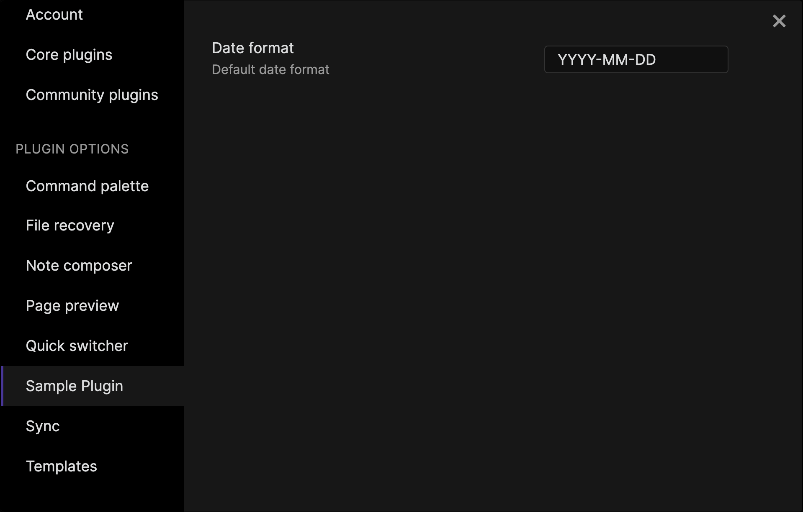

# Settings

If you want users to be able to configure parts of your plugin themselves, you can expose them as _settings_.

In this guide, you'll learn how to create a settings page like this 👇



The main reason to add settings to a plugin is to store configuration that persists even after the user quits Obsidian. The following example demonstrates how to save and load settings from disk:

```ts title="main.ts"
import { App, Plugin } from "obsidian";

interface ExamplePluginSettings {
  dateFormat: string;
}

const DEFAULT_SETTINGS: Partial<ExamplePluginSettings> = {
  dateFormat: "YYYY-MM-DD",
};

export default class ExamplePlugin extends Plugin {
  settings: ExamplePluginSettings;

  async onload() {
    await this.loadSettings();
  }

  async loadSettings() {
    this.settings = Object.assign(DEFAULT_SETTINGS, await this.loadData());
  }

  async saveSettings() {
    await this.saveData(this.settings);
  }
}
```

There's a lot going on here 🤯, so let's look closer at each part.

## Create a settings definition

First, you need to create a definition, `ExamplePluginSettings`, for what settings you want the user to be able to configure. While the plugin is enabled, you can access the settings from the `settings` member variable.

```ts
interface ExamplePluginSettings {
  dateFormat: string;
}

export default class ExamplePlugin extends Plugin {
  settings: ExamplePluginSettings;

  // ...
}
```

## Save and load the settings object

`loadData()` and `saveData()` provide an easy way to store and retrieve data from disk. The example also introduces two helper methods that makes it easier to use `loadData()` and `saveData()` from other parts of the plugin.

```ts
export default class ExamplePlugin extends Plugin {

  // ...

  async loadSettings() {
    this.settings = Object.assign(DEFAULT_SETTINGS, await this.loadData());
  }

  async saveSettings() {
    await this.saveData(this.settings);
  }
}
```

## Provide default values

When the user enables the plugin for the first time, none of the settings will have been configured yet. The example above provides default values for any missing settings.

To understand how this work, let's look a little closer at this code:

```ts
Object.assign(DEFAULT_SETTINGS, await this.loadData())
```

`Object.assign()` is a JavaScript function that copies all properties from one object to another. Any properties that are returned by `loadData()` override the properties in `DEFAULT_SETTINGS`.

```ts
const DEFAULT_SETTINGS: Partial<ExamplePluginSettings> = {
  dateFormat: "YYYY-MM-DD",
};
```

:::tip
`Partial<Type>` is a TypeScript utility that returns a type with all properties of `Type` set to optional. It enables type checking while letting you only define the properties you want to provide defaults for.
:::

## Register a settings tab

The plugin can now save and load plugin configuration, but the user doesn't yet have any way of changing any of the settings. Let's change that by creating a _settings tab_.

```ts title="main.ts"
import { App, PluginSettingTab, Setting } from "obsidian";

class ExampleSettingTab extends PluginSettingTab {
  plugin: ExamplePlugin;

  constructor(app: App, plugin: ExamplePlugin) {
    super(app, plugin);
    this.plugin = plugin;
  }

  display(): void {
    let { containerEl } = this;

    containerEl.empty();

    new Setting(containerEl)
      .setName("Date format")
      .setDesc("Default date format")
      .addText((text) =>
        text
          .setPlaceholder("MMMM dd, yyyy")
          .setValue(this.plugins.settings.dateFormat)
          .onChange(async (value) => {
            this.plugin.settings.dateFormat = value;
            await this.plugin.saveSettings();
          })
      );
  }
}
```

`display()` is where you build the content for the settings tab.

`new Setting(containerEl)` appends a setting to the container element. This example uses a text field using `addText()`, but there are several other setting types available.

Update the settings object whenever the value of the text field changes, and then save it to disk:

```ts {2,3}
.onChange(async (value) => {
  this.plugin.settings.dateFormat = value;
  await this.plugin.saveSettings();
})
```

Once you're happy with it, register the settings tab in the `Plugin` class.

```ts
async onload() {
  this.addSettingTab(new ExampleSettingTab(this.app, this));
}
```

Nice work! 💪 Your users will thank you for giving them a way to customize how they interact with your plugin. Before heading to the next guide, experiment with what you've leared by adding another setting.
